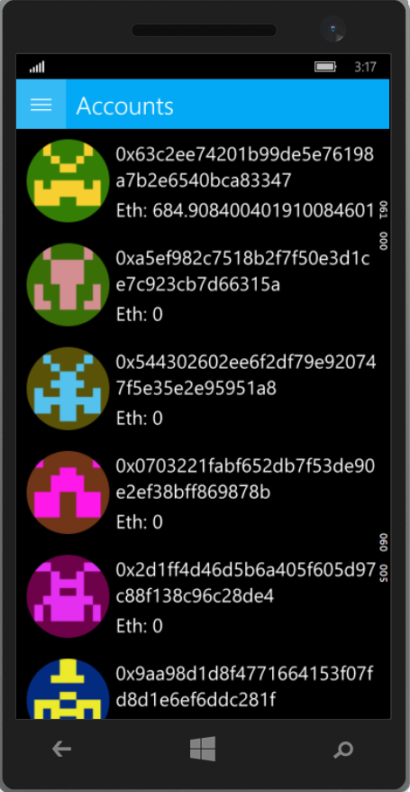
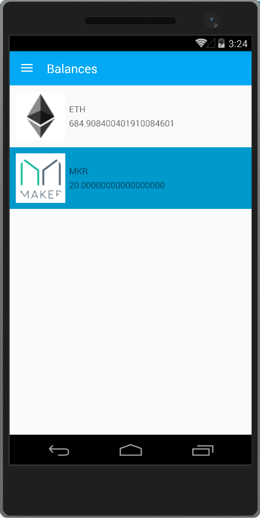
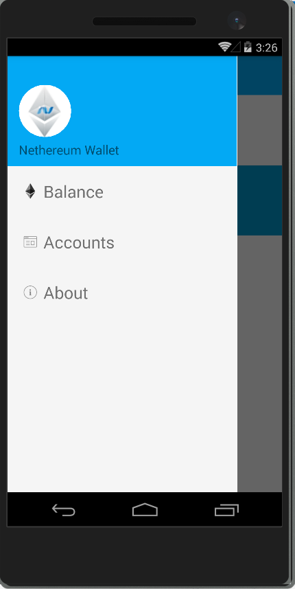
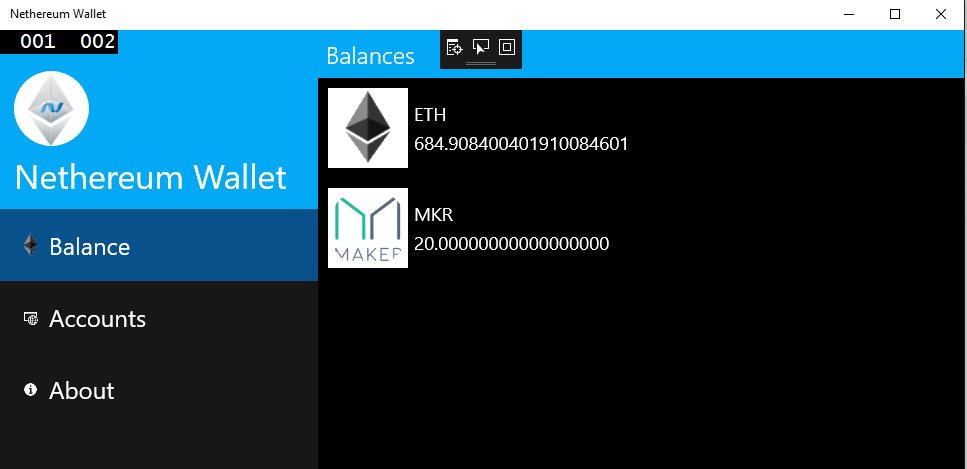

# Nethereum.UI.Wallet.Sample

Cross platform wallet example using Nethereum, Xamarin.Forms and MvvmCross.

Work in progress.

## Screenshots from Morden

### Done

* Nethereum.Wallet generic interfaces, summary of balances, accounts, token registry.
* Validated usage for common methods, contract, eth.
* Generic MvxFormsShellPagePresenter for hambuger, slider navigation.
* Generic UI
* Tested on UWP (Windows 10, Windows 10 Phone) and Android. 

### Todo

* iOS test.
* Transfer example.
* Registry of assets, sql lite storage
* Screen configuration
* Transactions storage and watch for registered tokens / eth.
